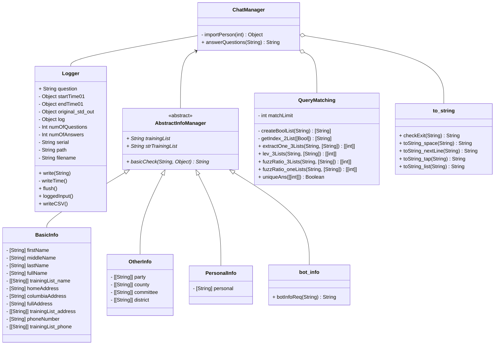

```mermaid
classDiagram

%% Link (Solid)
ChatManager -- Logger

%% Association
ChatManager <-- AbstractInfoManager

%% Aggregation
ChatManager o-- QueryMatching
ChatManager o-- to_string

%% Inheritance
AbstractInfoManager <|-- BasicInfo
AbstractInfoManager <|-- OtherInfo
AbstractInfoManager <|-- PersonalInfo
AbstractInfoManager <|-- bot_info

to_string : + checkExit(String) String
to_string : + toString_space(String) String
to_string : + toString_nextLine(String) String
to_string : + toString_tap(String) String
to_string : + toString_list(String) String

class Logger {
    + String question
    - Object startTime01
    - Object endTime01
    - Object original_std_out
    - Object log
    - Int numOfQuestions
    - Int numOfAnswers
    - String serial
    - String path
    - String filename
    + write(String)
    - writeTime()
    + flush()
    + loggedInput()
    + writeCSV()
}

<<abstract>> AbstractInfoManager
class AbstractInfoManager {
    + String trainingList*
    + String strTrainingList*
    + basicCheck(String, Object)* String
}

bot_info : + botInfoReq(String) String

class BasicInfo {
    - [String] firstName
    - [String] middleName
    - [String] lastName
    - [String] fullName
    - [[String]] trainingList_name
    - [String] homeAddress
    - [String] columbiaAddress
    - [String] fullAddress
    - [[String]] trainingList_address
    - [String] phoneNumber
    - [[String]] trainingList_phone
}

class OtherInfo {
    - [[String]] party
    - [[String]] county
    - [[String]] committee
    - [[String]] district
}

class PersonalInfo {
    - [String] personal
}

class ChatManager {
    - importPerson(int) Object
    + answerQuestions(String) String
}

class QueryMatching {
    - int matchLimit
    - createBoolList(String) [String]
    - getIndex_2List([Bool]) [String]
    + extractOne_3Lists(String, [String]) [[int]]
    + lev_3Lists(String, [String]) [[int]]
    + fuzzRatio_3Lists(String, [String]) [[int]]
    + fuzzRatio_oneLists(String, [String]) [[int]]
    + uniqueAns([[int]]) Boolean
}
```